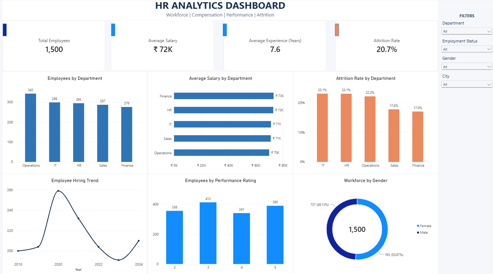

# HR Analytics — SQL & Power BI

An HR analytics project using SQL Server and Power BI to analyze workforce composition, compensation, employee performance, hiring trends, and attrition.

## Dashboard Preview



## Project Overview

This project analyzes employee data to identify patterns across departments, salaries, performance ratings, hiring trends, workforce demographics, and employee attrition.

The project combines SQL Server for data analysis and Power BI for interactive data visualization.

## Business Objectives

- Analyze workforce distribution across departments
- Compare average salaries across departments
- Identify departments with higher attrition
- Analyze employee performance ratings
- Examine hiring trends over time
- Compare workforce distribution by gender
- Identify salary patterns and high-performing employees

## Tools & Technologies

- SQL Server
- T-SQL
- Power BI
- DAX
- Data Visualization
- GitHub

## SQL Analysis

The SQL analysis contains 30 business-oriented queries covering:

- Employee counts
- Salary analysis
- Department analysis
- Gender analysis
- Performance analysis
- Attrition analysis
- Hiring trends
- Salary ranking
- Department-level comparisons
- Employee-level analysis

See the complete SQL analysis:

[HR Analytics SQL Queries](SQL/HR_Analytics_Queries.sql)

## Power BI Dashboard

The Power BI dashboard provides an interactive view of:

- Total Employees
- Average Salary
- Average Experience
- Attrition Rate
- Employees by Department
- Average Salary by Department
- Attrition Rate by Department
- Employee Hiring Trend
- Employees by Performance Rating
- Workforce by Gender

Interactive slicers are provided for:

- Department
- Employment Status
- Gender
- City

## Key Insights

- Operations has the highest number of employees.
- Finance has the lowest employee count among the departments.
- IT and HR show the highest department-level attrition rate.
- Average salaries are relatively consistent across departments.
- Employee hiring peaked around 2020.
- Workforce distribution by gender is nearly balanced.
- Performance rating 3 has the highest number of employees.

## Project Structure

```text
HR-Analytics-SQL-PowerBI/
│
├── Dashboard/
│   └── HR_Analytics_Dashboard.png
│
├── Data/
│   └── HR_Analytics.csv
│
├── PowerBI/
│   └── HR_Analytics_Dashboard.pbix
│
├── SQL/
│   └── HR_Analytics_Queries.sql
│
└── README.md
